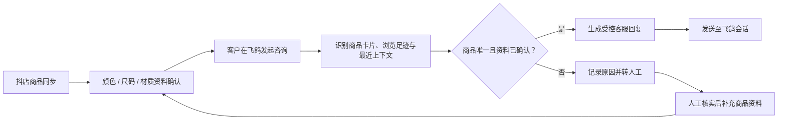

# 商家客服 Agent

> **商品事实优先的电商客服 Agent** ｜当前支持抖店飞鸽｜商家后台 + Chrome 扩展 + 人工接管

这是一个面向电商商家的 AI 客服 V1。项目不追求“什么都能自动答”，而是让 AI 只回答有已确认依据的商品事实；商品不明确、资料缺失或涉及服务承诺时，统一转交人工。

> **项目状态：测试期（V1）**。当前已完成抖店商品资料与飞鸽会话场景的验证；淘宝、拼多多等平台尚未接入，属于后续迭代方向。

## 1. 要解决什么问题？

电商售前客服经常遇到：商品多、客户只说“这双”、上下文不完整，客服或模型很容易答错商品；而直接让模型自由生成，又可能编造颜色、尺码、发货时效等信息。

本项目的原则是：**商品事实明确才自动答；商品不唯一、资料缺失或涉及服务承诺时，转人工。**

## 2. 当前支持范围

| 场景 | 当前状态 | 处理方式 |
| --- | --- | --- |
| 抖店商品资料同步与确认 | 已支持 | 采集颜色、尺码、材质等资料，人工确认后才进入知识库 |
| 抖店飞鸽会话 | 已支持 | 通过 Chrome 扩展识别会话与商品上下文 |
| 材质、颜色、尺码等商品事实问答 | 已支持 | 仅引用已确认资料进行受控回复 |
| 发货时效、售后、退款、尺码建议 | 已支持分流 | 不自动承诺，转人工处理 |
| 淘宝、拼多多等其他平台 | 规划中 | 未来通过平台适配层接入，不在当前 V1 范围内 |

## 3. 产品流程



## 4. 系统由什么组成？

```text
商家客服中心（网页后台）
  ├─ 商品同步、资料确认、知识库管理
  ├─ 会话问答测试与人工接管队列
  └─ 查看同步与处理记录

Chrome 扩展（飞鸽侧边栏）
  ├─ 监听飞鸽会话、商品卡片与上下文
  ├─ 请求后台生成受控回复草稿
  └─ 按规则发送或交由人工继续处理
```

## 5. 当前交付形态与安装方式

### 这是插件还是应用程序？

本项目是一个**组合式 Agent 应用**：

- **商家客服中心网页后台**：用于商品同步、资料确认、知识库管理、人工接管与测试；
- **Chrome 扩展**：作为飞鸽工作台内的侧边栏插件，负责读取当前会话与商品上下文、展示草稿并按规则发送；
- **不是桌面 `.exe` 软件**：当前没有打包 Windows 安装包，也没有上架 Chrome Web Store。

### 别人现在能否安装使用？

**可以按开发者方式部署和体验，但还不是普通用户“一键下载即可用”的产品。**

体验者需要完成以下配置：

1. 部署自己的商家客服中心后台，并绑定 D1 数据库；
2. 配置自己的 Qwen / 阿里云百炼模型密钥；
3. 在 Chrome 开发者模式中加载本仓库的 `chrome-extension/`；
4. 将扩展中的后台地址替换为自己部署的地址；
5. 使用自己的抖店和飞鸽账号登录测试。

因此，当前更准确的表述是：**“可部署、可演示的测试期 V1”，而非面向所有商家的通用安装包。**

### Agent 业务能力表

> 下表描述的是 Agent 在系统内可调用的业务能力，不是对外开放的 API。

| 业务能力 | 触发条件 | 输出 / 动作 |
| --- | --- | --- |
| 商品资料同步 | 商家从后台发起同步 | 读取抖店商品基础信息和详情，建立待确认资料 |
| 商品事实确认 | 人工审核颜色、尺码、材质等字段 | 只有确认后的资料才能进入客服知识库 |
| 商品上下文识别 | 客户发送卡片、近期浏览商品或对话可关联时 | 锁定当前咨询商品；不唯一时请求补充卡片、链接、名称或货号 |
| 受控回复生成 | 商品唯一且问题属于已确认的商品事实 | 生成简短、自然的材质 / 颜色 / 尺码类回复草稿 |
| 自动回复预检 | 自动回复已开启 | 校验问题类型、资料完整度、频控和风险规则后决定是否发送 |
| 人工接管 | 售后、退款、发货承诺、尺码建议、资料缺失或商品不唯一 | 记录转人工原因，交由客服继续处理 |

### 后续发布计划

当多店铺配置、安装引导、平台授权与评测体系完善后，计划逐步支持：

1. 通过 Chrome Web Store 发布扩展；
2. 提供云端商家后台的账号与店铺接入流程；
3. 通过平台适配层接入淘宝、拼多多等其他电商平台；
4. 提供脱敏演示数据与一键体验环境。

## 6. 目录与关键文件说明

### 根目录文件

| 文件 | 功能 |
| --- | --- |
| `package.json` | 项目依赖、Node 版本要求与 `dev`、`build`、`lint` 等命令 |
| `vite.config.ts` | Vite、Vinext、Cloudflare 本地运行配置；默认创建名为 `DB` 的本地 D1 绑定 |
| `next.config.ts` | Next/Vinext 的基础配置入口 |
| `tsconfig.json` | TypeScript 编译规则与路径别名 |
| `drizzle.config.ts` | Drizzle 数据库迁移工具配置 |
| `.dev.vars.example` | 本地运行时变量模板，复制为 `.dev.vars` 后填写模型密钥 |
| `.env.example` | 配置项参考清单，说明变量用途；不放真实密钥 |
| `.gitignore` | 排除真实店铺资料、浏览器资料、日志、密钥与构建产物 |

### `app/`：商家后台与 API

| 文件 / 目录 | 功能 |
| --- | --- |
| `app/page.tsx` | 商家客服中心首页，组织商品、知识库、会话与接管界面 |
| `app/layout.tsx` | 应用全局布局与页面元信息 |
| `app/globals.css` | 后台页面的全局样式 |
| `app/api/chat/route.ts` | 客服问答入口：校验店铺范围后生成受控回复 |
| `app/api/model/status/route.ts` | 返回 Qwen 模型是否已配置，用于后台状态提示 |
| `app/api/workspace/route.ts` | 读取商家工作台聚合数据 |
| `app/api/products/*` | 商品查询、导入、更新与旧数据清理 |
| `app/api/product-details/*` | 商品详情采集结果、人工确认与批量确认 |
| `app/api/sources/*` | 外部商品来源的采集、关联、确认与自动匹配 |
| `app/api/conversations/route.ts` | 会话列表与消息记录 |
| `app/api/tickets/route.ts` | 人工接管工单的创建与查询 |
| `app/api/sync-runs/route.ts` | 商品同步任务的进度与历史记录 |
| `app/api/local-connector/*` | 扩展与后台之间的商品查询、回复草稿接口 |
| `app/api/stores/route.ts`、`security/activity/route.ts` | 店铺范围与安全活动记录 |

### `components/`：后台功能模块

| 文件 | 功能 |
| --- | --- |
| `account-menu.tsx` | 当前商家 / 账号菜单 |
| `draft-workbench.tsx` | 客服问题输入、回复草稿预览与测试 |
| `product-detail-knowledge-panel.tsx` | 商品详情资料确认区，决定哪些资料可被客服引用 |
| `source-mapping-panel.tsx` | 店铺商品与来源资料之间的关联管理 |
| `store-connections-panel.tsx` | 店铺与平台连接状态展示 |
| `sync-task-panel.tsx` | 商品同步与详情补齐任务的进度展示 |

### `lib/`：Agent 规则与业务逻辑

| 文件 | 功能 |
| --- | --- |
| `catalog-db.ts` | 商品、知识、会话、工单等数据库读写封装 |
| `customer-service.ts` | 客服决策核心：判断商品匹配、资料是否充分、是否需要人工 |
| `customer-reply.ts` | 生成最终客服回复，并返回可否自动发送等标记 |
| `product-facts.ts` | 清洗颜色、尺码等商品字段，过滤“上移/下移”等无效属性值 |
| `qwen.ts` | 调用 Qwen 模型生成草稿；提示词限定只能基于已确认资料回答 |
| `request-shop.ts` | 从请求中识别店铺范围，避免不同店铺数据混用 |
| `platform-adapters.ts` | 平台适配层入口；未来接入淘宝、拼多多时在此扩展 |
| `source-collector.ts` | 解析和处理外部来源商品资料 |

### `chrome-extension/`：飞鸽侧边栏扩展

| 文件 | 功能 |
| --- | --- |
| `manifest.json` | 扩展权限、可访问页面和内容脚本声明 |
| `background.js` | 扩展核心调度：会话事件、草稿请求、自动回复预检、频控与人工兜底 |
| `feige-listener.js` | 监听飞鸽会话中的客户消息与商品卡片 |
| `dashboard-bridge.js` | 连接商家后台与扩展，传递商品查询和回复草稿请求 |
| `douyin-product-listener.js` | 从抖店商品列表页读取商品基础信息 |
| `douyin-detail-listener.js` | 从抖店商品详情页读取颜色、尺码、材质等详情 |
| `popup.html`、`popup.js` | Chrome 工具栏弹窗，用于开关与状态查看 |

### `db/`、`drizzle/` 与 `scripts/`

| 目录 / 文件 | 功能 |
| --- | --- |
| `db/schema.ts` | 数据表定义：商品、同步任务、会话、消息、人工工单、来源资料、知识条目等 |
| `drizzle/0000_*.sql`、`0001_*.sql` | 数据库建表和后续变更迁移 |
| `scripts/collect-douyin-*.mjs` | 抖店商品列表及详情采集示例 |
| `scripts/feige-*.mjs`、`sync-feige-active-product.mjs` | 飞鸽会话、草稿和当前商品上下文同步示例 |
| `scripts/*source*.mjs`、`merge-*.mjs` | 来源商品关联、资料合并与确认辅助脚本 |
| `scripts/validate-product-knowledge.mjs` | 检查商品资料是否满足进入客服知识库的条件 |

## 7. 环境配置与本地运行

### 6.1 前置条件

- Node.js `22` 或更高版本；
- pnpm；
- Chrome（需要测试飞鸽侧边栏时）；
- 可选：阿里云百炼 Qwen API Key（未配置时，模型草稿能力不会启用）。

### 6.2 安装依赖

```bash
pnpm install
```

### 6.3 配置模型变量

将 `.dev.vars.example` 复制为 `.dev.vars`，然后仅在本机填写自己的密钥：

```text
DASHSCOPE_API_KEY=你的阿里云百炼APIKey
DASHSCOPE_BASE_URL=https://dashscope.aliyuncs.com/compatible-mode/v1
```

- `DASHSCOPE_API_KEY`：Qwen 模型密钥，模型草稿生成需要它；
- `DASHSCOPE_BASE_URL`：可选，默认使用百炼 OpenAI 兼容接口；
- `DASHBOARD_URL`：仅供商品同步类脚本使用，填写自己部署的后台地址；
- `D1_BINDING`：本地数据库绑定名称，默认 `DB`，通常无需修改。

> `.dev.vars`、`.env.local`、真实 Cookie、店铺资料、Excel/CSV 都不能上传 GitHub。

### 6.4 启动后台

```bash
pnpm dev
```

本项目使用 Cloudflare D1 作为数据层。部署到自己的环境时，需要创建并绑定名为 `DB` 的 D1 数据库，并按 `drizzle/` 中的迁移文件初始化表结构。

### 6.5 加载 Chrome 扩展

1. 在 `chrome-extension/background.js` 中将 `DASHBOARD_ORIGIN` 改成自己的后台地址；
2. 在 `chrome-extension/manifest.json` 中将同一后台地址加入 `host_permissions` 与 `matches`；
3. 打开 Chrome 的 `chrome://extensions`，开启开发者模式；
4. 点击“加载已解压的扩展程序”，选择 `chrome-extension/` 文件夹；
5. 打开自己的后台与抖店飞鸽页面，扩展才会开始协作。

## 8. 模型配置

当前 V1 使用阿里云百炼的 OpenAI 兼容接口调用 Qwen。模型密钥只配置在**服务端环境变量**中，不会写入仓库，也不会下发到 Chrome 扩展或浏览器页面。

| 配置项 | 用途 | 当前状态 |
| --- | --- | --- |
| `DASHSCOPE_API_KEY` | 调用 Qwen 的阿里云百炼 API Key | 必填；仅在本地 `.dev.vars` 或部署平台密钥管理中保存 |
| `DASHSCOPE_BASE_URL` | 百炼 OpenAI 兼容接口地址 | 可选；默认 `https://dashscope.aliyuncs.com/compatible-mode/v1` |
| `D1_BINDING` | 商品、会话、知识库的数据绑定名称 | 默认 `DB`，通常无需修改 |
| `DASHBOARD_URL` | 供商品同步辅助脚本访问的后台地址 | 按需配置 |

配置示例：

```text
DASHSCOPE_API_KEY=你的阿里云百炼APIKey
DASHSCOPE_BASE_URL=https://dashscope.aliyuncs.com/compatible-mode/v1
```

> 当前版本没有模型切换设置页，也未验证 DeepSeek、Kimi 等多模型兼容性。因此本项目只承诺支持已验证的 Qwen 配置。

后续会把模型调用进一步抽象为 Provider 层，在验证回复质量、成本、稳定性和工具调用兼容性后，再逐步支持多模型配置与连通性测试。

## 9. V1 已验证场景

- 客户发送商品卡片后，询问材质、颜色、尺码等商品事实；
- 无商品卡片时，结合最近浏览或会话上下文辅助判断；
- 上下文不唯一时，不猜测具体商品，提示补充链接、卡片、名称或货号；
- 对发货时间、售后、退款、尺码建议等服务承诺类问题转人工；
- 已确认商品资料可形成自然、简短的客服回复。

## 10. 测试期说明与后续规划

当前项目处于测试期，重点验证“商品事实优先 + 风险转人工”的可控客服链路。它不是已经大规模商用的全能客服系统。

后续计划：

1. 接入淘宝、拼多多等其他电商平台，复用 `platform-adapters.ts` 的适配接口；
2. 增加商品匹配置信度与多候选商品澄清机制；
3. 将人工处理结果回流知识库，形成持续迭代闭环；
4. 建立标准评测集、准确率与人工接管率看板；
5. 完善多店铺角色权限与操作审计。

## 11. 数据与安全边界

- 本仓库是公开作品集版本，不含真实店铺数据、客户会话、浏览器登录资料或密钥；
- `data/`、`profiles/`、Excel/CSV、日志和发布包均已排除；
- 扩展不读取或上传用户 Cookie、会话 Token 等敏感信息；
- 连接真实电商平台前，应遵守平台规则、商家授权范围与隐私要求。
