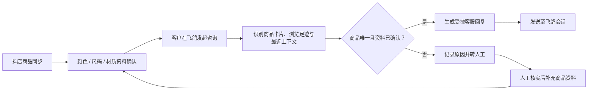

# 商家客服 Agent

> 商品事实优先的电商客服 Agent ｜飞鸽侧边栏 + 商家后台 + 人工接管

一个面向抖店商家的 AI 客服 V1。它不追求“什么都能答”，而是通过商品资料确认、会话上下文识别和风险分流，让 AI 只回答**有依据的商品事实**，不确定的问题及时交给人工。

**项目定位：** AI 产品经理作品集项目 / 可运行 V1 原型

## 1. 要解决什么问题？

电商售前客服经常面对商品多、咨询快、上下文不完整的情况：

- 客户问“这双什么材质”“有黑色吗”，客服可能不知道指的是哪一款商品；
- 直接让模型自由生成，容易出现编造颜色、尺码、发货时效等问题；
- 物流、售后、尺码建议等问题本身就需要人工核实。

本项目的核心原则是：**商品事实明确才自动答；商品不唯一、资料缺失或涉及服务承诺时，转人工。**

## 2. 产品方案



## 3. 核心能力

| 能力 | 做法 | 价值 |
| --- | --- | --- |
| 商品资料确认 | 仅将已核实的颜色、尺码、材质写入客服知识库 | 避免 AI 依据标题或脏数据编造事实 |
| 商品上下文识别 | 优先识别客户商品卡片；无卡片时结合浏览足迹与最近上下文 | 降低“答错商品”的风险 |
| 受控自动回复 | 仅对低风险、已确认商品事实自动回答 | 保证答案可追溯、可解释 |
| 人工接管 | 物流时效、售后、尺码建议、信息不足自动转人工 | 避免把不确定承诺发给客户 |
| 飞鸽侧边栏 | Chrome 扩展展示会话状态、草稿和接管记录 | 在客服现有工作流中完成协作 |

## 4. 系统形态

```text
商家客服中心（网页后台）
  ├─ 店铺商品同步与资料确认
  ├─ 商品知识库与人工接管队列
  └─ 客服问答测试与结果复盘

Chrome 扩展（飞鸽侧边栏）
  ├─ 监听会话与商品上下文
  ├─ 展示 Agent 状态与回复草稿
  └─ 受控发送 / 转人工
```

## 5. V1 已验证场景

- 已确认商品的材质、颜色、尺码、库存与价格问答；
- 客户发送商品卡片后的关联问答；
- 无商品卡片时，结合最近浏览或会话上下文判断；
- 上下文不唯一时不猜测，提示人工跟进；
- 对“发货时间”“售后”“尺码建议”等服务承诺类问题转人工。

## 6. 产品演示建议

演示时可按以下顺序操作：

1. 在飞鸽会话中让客户发送商品卡片，再提问“这双鞋是什么材质？”；
2. Agent 识别关联商品，并只引用已确认的商品资料回复；
3. 再问“什么时候可以发货？”；
4. Agent 不承诺时效，而是记录并转交人工客服。

## 7. 技术结构

| 目录 | 说明 |
| --- | --- |
| `app/`、`components/` | 商家客服中心后台与 API |
| `lib/` | 商品事实清洗、问答决策、上下文匹配与权限控制 |
| `db/`、`drizzle/` | 商品、知识确认、会话与人工接管数据结构 |
| `chrome-extension/` | 飞鸽页面监听、Agent 面板与受控消息发送 |
| `scripts/` | 商品同步与资料处理示例脚本 |

## 8. 本地运行

```bash
pnpm install
cp .env.example .env.local
pnpm dev
```

如需模型能力，在 `.env.local` 中填写自己的 `QWEN_API_KEY`。扩展使用前，请将 `chrome-extension/background.js` 和 `manifest.json` 中的 `https://your-dashboard.example.com` 替换为自己的后台地址。

## 9. 数据与安全边界

- 本仓库是公开作品集版本，不含真实店铺数据、客户会话、浏览器登录资料或密钥；
- `data/`、`profiles/`、Excel/CSV、日志和发布包均已排除；
- 不读取或上传用户 Cookie、会话 Token 等敏感信息；
- 接入真实平台前，需要遵守平台规则、商家授权范围及隐私要求。

## 10. V1 的边界与后续方向

当前 V1 聚焦验证“商品事实优先 + 风险转人工”的闭环，不将其包装成覆盖全部售前、售后和物流问题的万能客服。

后续可继续完善：商品匹配置信度、人工处理结果回流、评测集与准确率看板、多店铺权限隔离。
